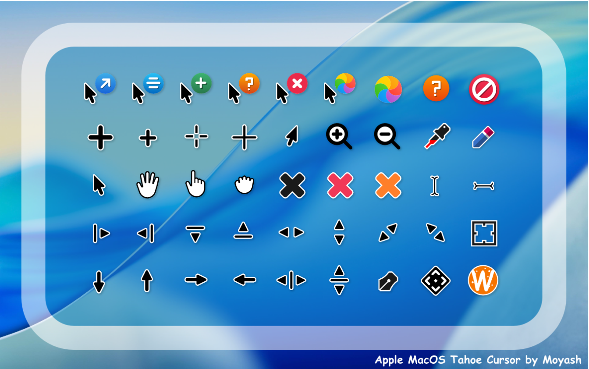

This snap package contains the MacOS-Tahoe-Cursor Theme, an X-cursor theme inspired by macOS.
https://www.gnome-look.org/p/2300466

The goal of this snap package is to unify your cursor themes, as snap packages do not have direct access to the /usr/share/icons directory. If you set a custom cursor that is not applied to your snap packages for example.

Use-case of this repo:
1. You have installed the following cursor *already* globally: https://www.gnome-look.org/p/2300466
2. You want to make the same cursors applied to your snap packages



Cursor created by Moyash
---

## Building the snap locally

Requirements
* [snapcraft](https://snapcraft.io/snapcraft) (```snap install snapcraft```)
* [multipass](https://snapcraft.io/multipass) (```snap install multipass```)

```sh
snapcraft

# where CURRENT is the latest version of MacOS-Tahoe-Cursor
# and --dangerous since this local snap hasn't been verified
snap install macos-tahome-cursor-snap_CURRENT_amd64.snap --dangerous

```

## Applying the theme

In order to work, the snap package needs to have a '[plug](https://ubuntu.com/blog/a-guide-to-snap-permissions-and-interfaces)' 
available for 'icon-themes'.

To apply the theme to a single application, perform the following:

```bash
sudo snap connect [snap-you-want-to-theme]:icon-themes macos-tahome-cursor-snap:icon-themes
```

To apply to all applications run the following command. Thanks to @flexiondotorg for the handy loop.

```bash
for plug in $(snap connections | grep gtk-common-themes:icon-themes | awk '{print $2}'); do sudo snap connect ${plug} macos-tahome-cursor-snap:icon-themes; done
```

*NOTE*: Some apps like the Ubuntu Snap Store may require logging out, and back in to load the changes.


Set the following env variables

```bash
sudo nano /etc/environment
```

```bash
XCURSOR_THEME=MacOS-Tahoe-Cursor
XCURSOR_SIZE=48
```


